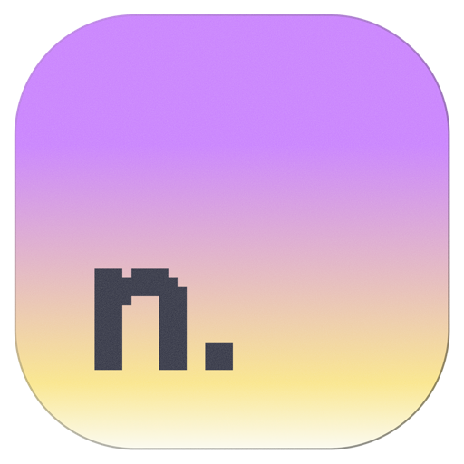
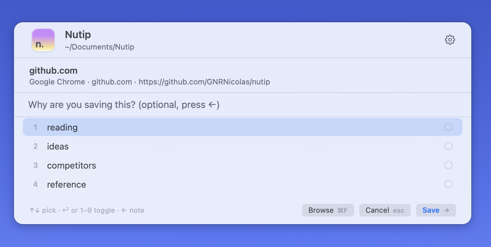
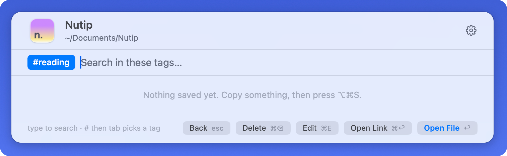
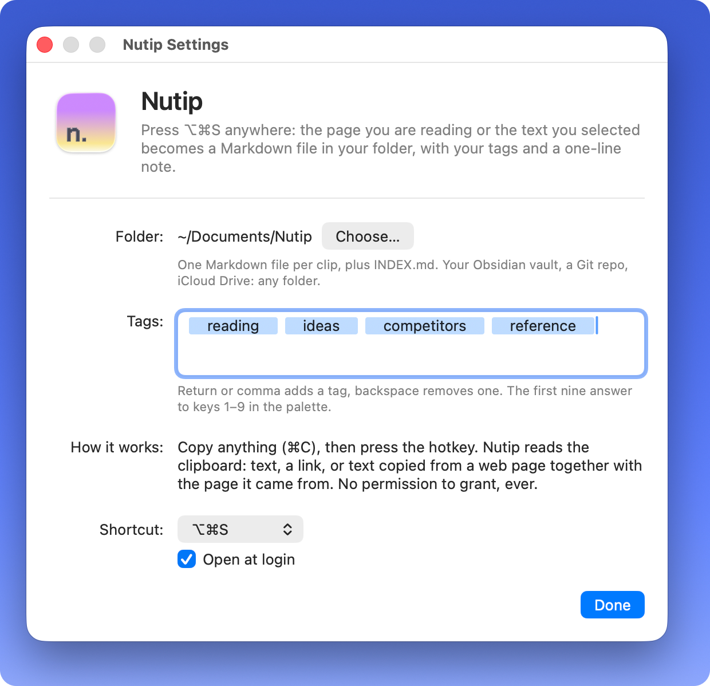

<p align="center">
  
</p>

<h1 align="center">Nutip</h1>

Save anything as Markdown, for you and your AI. Copy something, press a key,
pick a tag, done. Nutip writes one `.md` file per clip into a folder you own,
and keeps an index an AI agent can read in one go.

No account, no permission to grant, no database you cannot open, no AI
inside. The folder is the product.

<p align="center">
  
</p>

## Install

### Manual

```sh
git clone https://github.com/GNRNicolas/nutip.git && cd nutip && ./build.sh --install
```

Builds it, puts it in `/Applications`, starts it, and links the `nutip`
command into your shell. Needs macOS 13+ and the Xcode command line tools
(`xcode-select --install`). No dependencies.

Nutip lives in the menu bar as a tray icon. The first launch asks for a
folder and your first tags.

### With an agent

Copy this into Claude Code, Codex, Cursor or whatever you use, and let it do
the whole thing:

```text
Install Nutip on my Mac. It is a macOS menu-bar app: no dependencies, no account,
and it asks for no macOS permission, so nothing should prompt me.

1. Clone https://github.com/GNRNicolas/nutip into a folder I keep (not /tmp). Ask
   me where if you are unsure.
2. Run ./build.sh --install in it. It needs the Xcode command line tools: if they
   are missing, tell me to run xcode-select --install rather than guessing.
3. Choose where my clips should live, and this matters more than the rest: one
   Markdown file per clip goes there, and that folder is what you will read later
   to answer me. Look at what I already have — a notes repo, an Obsidian vault, a
   memory folder — propose one place, and once I agree:
      nutip folder <path>
   Do not leave it on the default (~/Documents/Nutip) without asking me.
4. Set the tags I will actually use, as few as possible, from what you know of my
   work: nutip tags add <tag> <tag>...
5. If I use Claude Code, link the skill that ships with Nutip, with an absolute
   path to the clone:
      mkdir -p ~/.claude/skills && ln -sfn <clone>/skills/nutip ~/.claude/skills/nutip
6. Run `nutip doctor` and tell me in three lines: where my clips will be saved,
   what the hotkey is, and that the gesture is copy with ⌘C, then the hotkey. Say
   that the first launch window is already filled in and I just have to confirm.

If a step fails, show me the exact error instead of working around it. If the
hotkey seems dead once installed, another app has it: macOS gives no warning, so
tell me to pick another one in the settings window.
```

On first launch Nutip asks for a folder and your first tags, and then lives in
the menu bar.

The repo ships a [`nutip` skill](skills/nutip/SKILL.md) so an agent knows how
to search your clips, save into them and keep them tidy. The clips folder also
gets its own `AGENTS.md`, which most agents pick up without being told.

## Use

Copy anything with **⌘C**, then press **⌥⌘S** (changeable). The palette opens
over whatever you are doing:

- Copied text becomes a text clip. A copied link becomes a link clip. Text
  copied from a web page in Safari, Chrome, Arc, Brave or Edge keeps the
  page it came from: the browser puts it on the clipboard, Nutip reads it.
- **↑↓** move through your tags, **1–9** (or **⌘1–9**) tick them, several are
  fine. **←** jumps to a one-line note: *why* you are saving this.
- **→** saves, with the tags you ticked, or with the highlighted one if you
  ticked none: one tag costs one key. **⌘→** saves with no tag at all. The
  footer always says which of these is about to happen.
- The palette closes at once; if there is a page, its readable text is
  fetched in the background and added to the file a couple of seconds later.

A small toast confirms, with **Undo** (⌘Z while it shows). Nothing to name,
nothing to file.

Press **←** from the palette, click **Browse**, or press **⌘F**, and it
switches to **browse** mode: type to search everything you saved — title,
note, tags, keywords and page text. Each result shows the passage that
matched, with your words in bold, so you pick without opening anything.

- **`#`** filters by tag, **`@`** by anything else: `@today`, `@week`,
  `@month`, `@year`, `@links`, `@text`, or a domain — `@github.com`. The list
  is read from your clips, so there is nothing to configure and nothing to
  maintain. A domain is offered once you have saved it three times — before
  that it is one clip, not a filter — but typing `@gith…` finds it anyway.
- **tab** takes the highlighted suggestion, **⌫** on an empty field drops the
  last filter.
- **↩** opens the file in your editor, **⌘↩** opens the original link,
  **⌘E** edits tags and note, **⌘D** deletes.

<p align="center">
  
</p>

### The folder

```
Nutip/
  INDEX.md               counts, every tag, every month, the 500 most recent clips
  AGENTS.md              the same folder, explained to an AI agent
  README.md              the same, for a human
  tags/reading.md        one tag, newest first
  2026-09/
    INDEX.md             everything saved that month
    2026-09-13-title-of-the-thing.md
```

Ten thousand clips change none of that: `INDEX.md` stays one read, the monthly
pages hold the rest, and saving a clip rewrites only the pages that mention
it.

One clip:

```markdown
---
title: "Markdown - Wikipedia"
url: https://en.wikipedia.org/wiki/Markdown
source: "Safari · en.wikipedia.org"
captured_at: 2026-09-13T14:03:22+02:00
tags: [reading, reference]
why: "the CommonMark history, for the docs"
keywords: [markdown, commonmark, gruber, syntax, markup, heading, text, github]
---

# Markdown - Wikipedia

<https://en.wikipedia.org/wiki/Markdown>

The paragraph you had selected, if any.

---

**Markdown** is a lightweight markup language for creating formatted text…
```

Point the folder at your Obsidian vault, a Git repo, iCloud Drive. Nutip
does not care, and never needs to be running for the files to be useful.

### For AI agents

Point Claude, Cursor, Codex or anything else at the folder. It is built to be
read by one:

- `AGENTS.md` is picked up on its own by most coding agents. It says what the
  folder is, what to read first, and what never to edit.
- `INDEX.md` is one read whatever the size: the totals, every tag and every
  month as links, then the 500 most recent clips, each with its date, source,
  tags and `why`. An agent picks the three files worth opening instead of
  reading a thousand.
- `why` is the one thing an agent cannot infer: the reason a human kept it.
  It is on every index line.
- `nutip search "…" --json` returns the same rows with an absolute `file`
  path, so an agent can go straight to the text. Plain `grep` works too, and
  the folder is just Markdown if Nutip is not installed.
- [`skills/nutip`](skills/nutip/SKILL.md) is a Claude Code skill: symlink it
  into `~/.claude/skills/` and your agent knows the commands, the tag
  discipline and what it must never overwrite.
- A clip file is capped at 40 000 characters of extracted page text, so
  opening one never costs an agent its context window. A long article lands
  right on that cap; most clips are a few kilobytes.
- `keywords:` is counted from the clip's own text — frequency and a stop list,
  no model, no network, no API key — and indexed alongside it, so a question
  that paraphrases the page still matches. Correct one by hand and it stays.
- Search is forgiving on purpose: ask it a whole question. The words are OR'd,
  filler words are dropped, the best match comes first, and only a `#tag` is
  required.
- It still matches words, not meaning, so **the language matters**. Measured on
  a 19-clip corpus of real pages: 5 French questions out of 10 found their clip;
  the same 5, re-asked in English, found it every time. An agent that re-asks in
  the language the page was written in turns 5/10 into 10/10, and `nutip search`
  says so itself when it comes back empty.

### Command line

The same binary is the CLI (`./build.sh --install` links it as `nutip`):

```sh
nutip recent 10                     # newest clips
nutip search "pricing #competitors" # full-text, #tag filters
nutip search "@week postgres"       # @ filters: a span of time, links/text, a domain
nutip filters                       # every @ filter available, read from your clips
nutip search claude --json          # for scripts and agents, with an absolute file path
nutip add https://example.com -t reading -w "the pricing table"
nutip add https://example.com -x    # same, and read the page into the clip
nutip rm 2026-09/2026-09-13-thing.md   # move a clip to the Trash, indexes updated
nutip extract https://example.com   # what a page becomes, on stdout
nutip reindex                       # rebuild INDEX.md, tags/ and the search index
nutip enrich                        # give keywords to the clips that have none (--dry-run to preview)
nutip folder ~/notes/clips          # move the clips folder; no argument prints it
nutip tags add veille               # what the palette offers; nutip tags rm to drop one
```

`folder` and `tags` are what let an agent set Nutip up end to end: everything
else about the app lives in a window. A running Nutip follows them at once.

### Settings

The folder, your tags, the hotkey and whether Nutip starts at login. That is
the whole of it.

<p align="center">
  
</p>

## Permissions

None. Nutip reads the clipboard, which any app may do, and nothing else. It
never asks for Accessibility or Automation, so nothing breaks when you
rebuild or update. That is why the gesture is *copy, then hotkey* rather
than *select, then hotkey*: reading a selection would need a permission
that macOS revokes at every reinstall of an unsigned app.

## Update

Nutip checks GitHub once a day and tells you when a release is out. It
downloads nothing; the update is:

```sh
git pull && ./build.sh --install
```

Turn the check off in the menu.

## Privacy

Nutip talks to the network twice: to fetch a page you just saved (through a
hidden web view, no cookies, forgotten afterwards) and to ask GitHub for the
latest version number, once a day, anonymously. Nothing else leaves your Mac.
The clipboard is read only when you press the hotkey, never watched.
Logs go to `~/Library/Logs/nutip.log`.

## Fork it

[FORKME.md](FORKME.md) is for changing the app; [SPECS.md](SPECS.md) for why
it is shaped this way. MIT.
